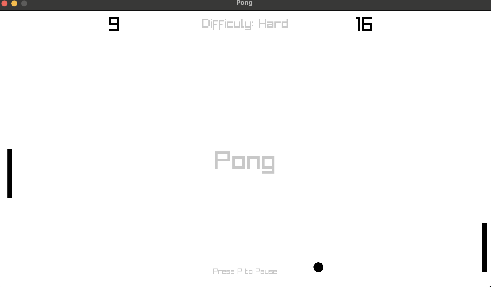
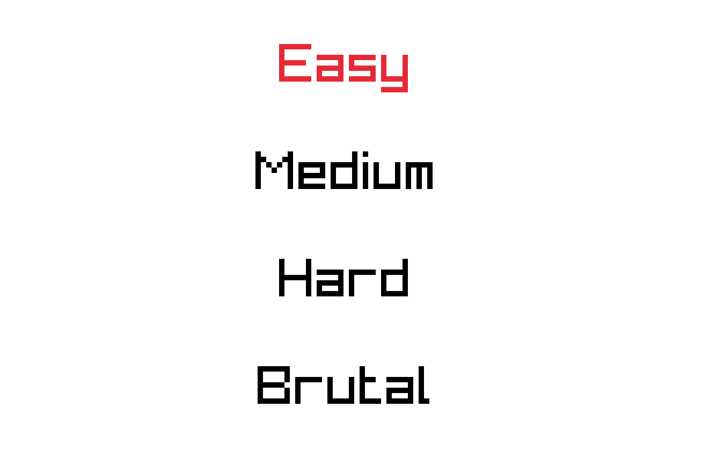
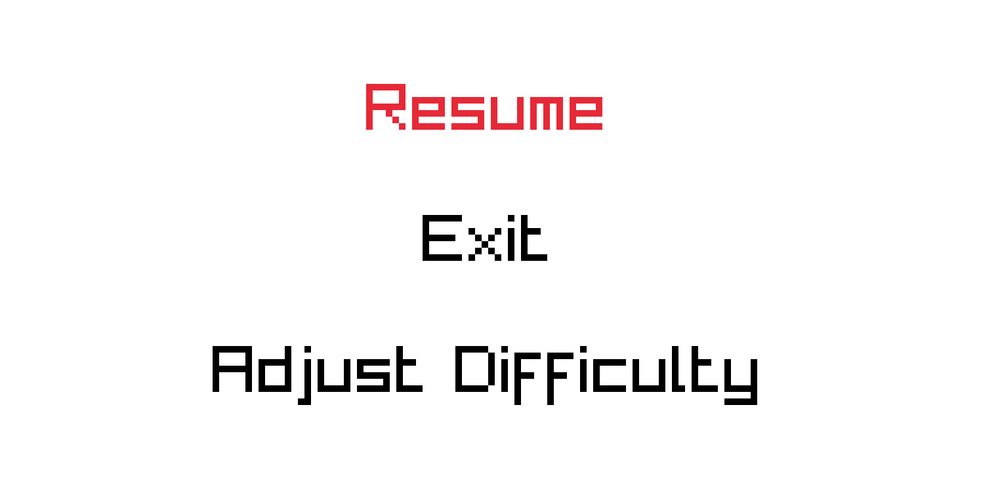

# Not-Just-Pong
This pong was developed in C++ using Raylib and a lot of exciting features

# Want to start playing?
[Download](https://aaryan-gulia.itch.io/not-just-pong) from itch.io! 

Only supported on MacOS right now. 

## Screenshots

*The Main Game Screen*

*Difficulty Selection*

*Pause Screen*
